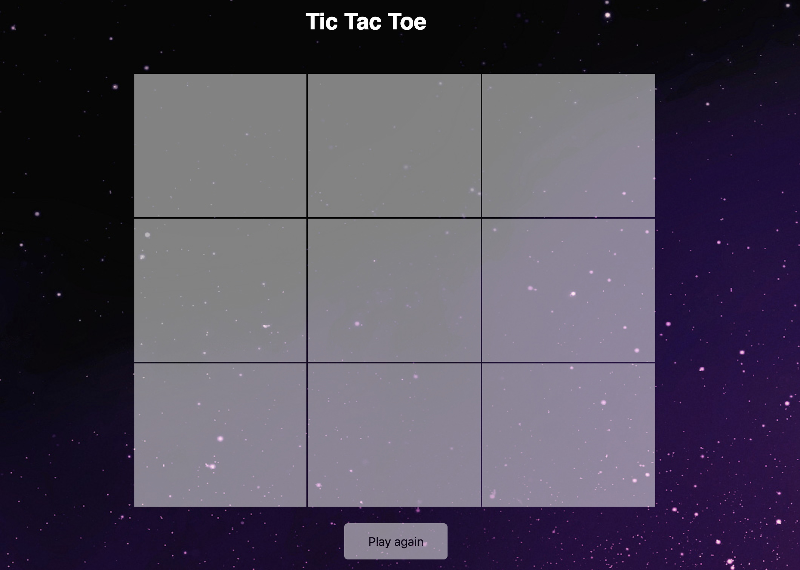

# Tic Tac Toe

Tic Tac Toe is X and O game where both players take a turn to make a move and compete to win. It's a pretty easy game, and you can try out different schemes to win.

You can play my game [here](https://hessaaqeel.github.io/project1_TicTacToe/firstpg)

 ## Technologies used: 
 1. JavaScript 
 2. HTML 
 3. CSS 

## Diffculties: 
-  Link every concept I have learned to solve one specific problem.
-  Thinking about choosing colors or styles, which I gave up in the end *.*
-  It took me so long to come up with solutions to my problems.

## Favorite Part: 
- Getting the code to run after struggling for hours trying to find the problem.
- Using JQuery and JavaScript was a good practice for me. 
- HTML was my favorite/easiest part of this project*.*

I used  JavaScript function with an if statement to change turns between two players, after the players finish their game there will be either one winner or a toe; where no one wins, to be able to do this I used an if statement to determine the winner and called the function. 

After the game is finished, the user can press a button to reload the page and start a new game. 

 In the future, I would like to add multiple players and count each player's score. I would also like to improve the style of my game, also get the player to compete against the computer  

## Acknowledgements: 

Thanks to [@mfalthaw](https://github.com/mfalthaw) for his positivity and support.

Thanks to Mr.Usman and Mr.Michael for their patience and support.

A big thanks to [@rawanah995](https://github.com/rawanah995) who helped to find a bug after I spent an entire day not knowing what was the problem. 

